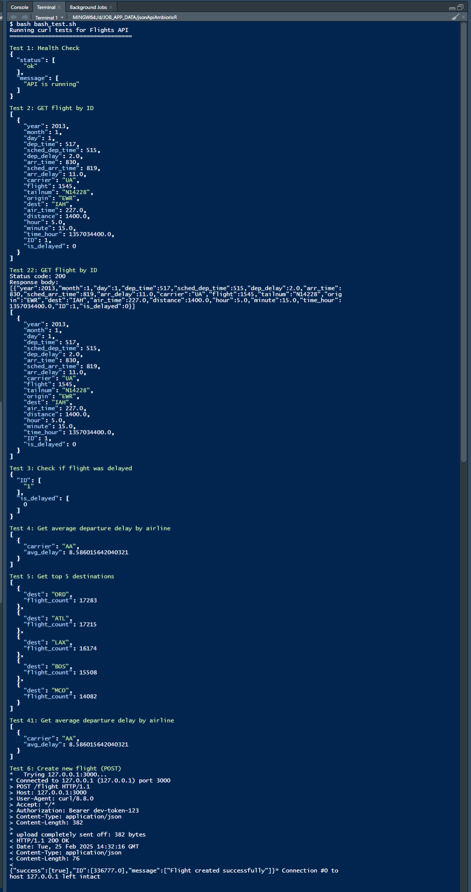
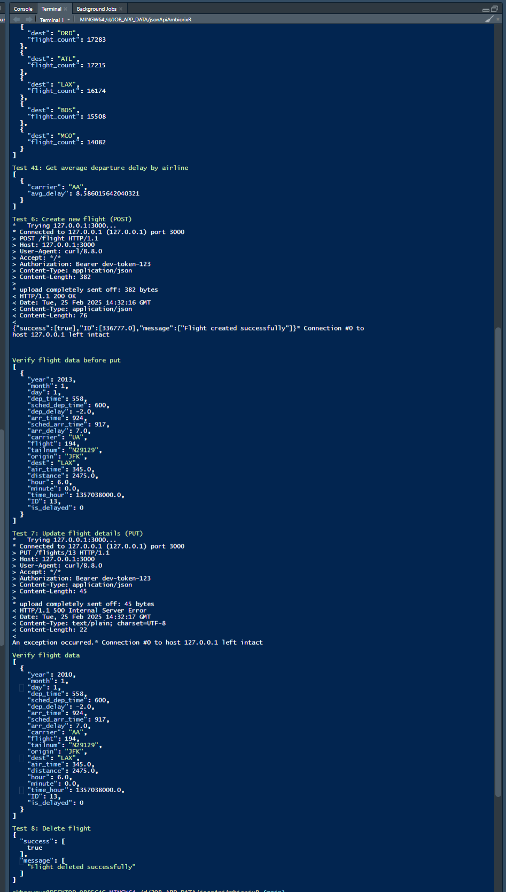

# jsonApiAmbiorixR-

## Overview

-   Build a simple JSON data API using **ambiorix** and process a dataset using **data.table**
-   The API exposes endpoints that allow users to interact with the processed data.
-   R code in [app.R](./app.R), Bash Curl unit test in  [bash_test.sh](./bash_test.sh) and logs in  [api.log](./api.log) 

## Dataset

-   We use the flights dataset from **ycflights13**

Tasks:

1.  Load the dataset and cast it into a data.table.
2.  Perform the following transformations:
    -   Compute the average departure delay for each airline.
    -   Find the top 5 destinations with the most flights.
    -   Create two new columns: one which is a unique id for each row/flight (created based on rownames), and another indicating whether a flight was delayed for more than 15 minutes.
3.  Save the processed data as a CSV or an SQLite database file.

## Part 2: JSON Data API

Using Ambiorix, implement these endpoints:

1.  POST /flight

-   Creates a new flight entry.
-   Accepts a JSON payload with flight details.

2.  GET /flight/:id

-   Returns details of the flight specified by that id.

3.  GET /check-delay/:id

-   Returns whether the flight is classified as “delayed”.

4.  GET /avg-dep-delay?id=given-airline-name

-   Returns the average departure delay of an airline.
-   Use query strings to access the given airline.
-   If no airline is provided, return all the airlines.

5.  GET /top-destinations/:n

-   Returns the top n destinations with the most flights.

6.  PUT /flights/:id

-   Update details of the flight specified by that id.
-   Accepts a JSON payload with the new details.

7.  DELETE /:id

-   Deletes the flight with the specified id.

## CODES

### R Code Snippets =\> code in [app.R](./app.R)

``` r
library(data.table)
library(nycflights13)
library(DBI)
library(RSQLite)
library(jsonlite)
library(ambiorix)

# define the port, db,log, rate,limits and authentications
config <- list(
  port = 3000,
  db_path = "flights.db",
  log_path = "api.log",
  rate_limit = 100,  # requests per minute
  cache_ttl = 300,   # cache timeout in seconds
  auth_token = "dev-token-123"  # authentication
)

# initialize logger
log_setup <- function(){
  logger::log_threshold(logger::DEBUG)
  logger::log_appender(logger::appender_file(config$log_path))
}

# Part 1: Data Processing
# Load and transform the flights dataset
process_flights_data <- function() {
    .
    .
    .
}
#' 
# Initialize SQLite database
setup_database <- function(processed_data) {
    .
    .
    .
}

# Database helper functions
get_db_connection <- function() {
    .
    .
    .
}

# Error Handling: orints out errors and log of errors
handle_error <- function(err) {
    .
    .
    .
}

# Part 2: API Implementation
create_app <- function() {
  app <- Ambiorix$new()
  
  # Debug log requests
  app$use(function(req, res) {
    logger::log_debug(paste("Received request:", req$method, req$path))
    return(TRUE)
  })
  
  # Basic health check that doesn't require auth
  app$get("/health", function(req, res) {
    res$json(list(status = "ok", message = "API is running"))
  })  
  
  # 1. POST /flight - Create new flight
  app$post(
    "/flight",
    function(req, res) {
    .
    .
    .
    })
  
  # 2. GET /flight/:id - Get flight details
  app$get("/flight/:id", function(req, res) {
    .
    .
    .
  })
  
  # 3. GET /check-delay/:id - Check if flight was delayed
  app$get("/check-delay/:id", function(req, res) {
    .
    .
    .
  })
  #
  # 4. GET /avg-dep-delay - Get average delay by airline
  app$get("/avg-dep-delay/:id", function(req, res) {
    .
    .
    .
  })
  #
  # 5. GET /top-destinations/:n - Get top n destinations
  app$get("/top-destinations/:n", function(req, res) {
    .
    .
    .
  })
  
  # 6. PUT /flights/:id - Update flight details
  app$put("/flights/:id", function(req, res) {
     .
    .
    .
  })
  # 7. DELETE /:id - Delete flight
  app$delete("/:id", function(req, res) {
    .
    .
    .
  })
  
  return(app)
}


# Server Initialization
# Initialize application
init_app <- function() {

}
init_app()
```

### Bash Test=\> Code in [bash_test.sh](./bash_test.sh)

``` bash
An Ambiorix App: App.R Unit Test in Bash using Curl: bash_test.sh

#!/bin/bash

# Configuration
API_URL="http://127.0.0.1:3000"
AUTH_TOKEN="dev-token-123"

# Color formatting
GREEN='\033[0;32m'
RED='\033[0;31m'
NC='\033[0m' # No Color

echo "Running curl tests for Flights API"
echo "==================================="

# Test 1: Health Check (No auth required)
echo -e "\n${GREEN}Test 1: Health Check${NC}"
curl -s "${API_URL}/health" | jq '.'

# Test 2: GET flight by ID (with auth)
echo -e "\n${GREEN}Test 2: GET flight by ID${NC}"
curl -s -H "Authorization: Bearer ${AUTH_TOKEN}" "${API_URL}/flight/1" | jq '.'

# TEST 22
echo -e "\n${GREEN}Test 22: GET flight by ID${NC}"
status_code=$(curl -s -o /tmp/response.txt -w "%{http_code}" -H "Authorization: Bearer ${AUTH_TOKEN}" "${API_URL}/flight/1")
echo "Status code: $status_code"
echo "Response body:"
cat /tmp/response.txt
echo ""
if cat /tmp/response.txt | jq '.' &>/dev/null; then
cat /tmp/response.txt | jq '.'
fi

# Test 3: Check if flight was delayed
echo -e "\n${GREEN}Test 3: Check if flight was delayed${NC}"
curl -s -H "Authorization: Bearer ${AUTH_TOKEN}" "${API_URL}/check-delay/1" | jq '.'

# Test 4: Get average departure delay by airline
echo -e "\n${GREEN}Test 4: Get average departure delay by airline${NC}"
curl -s -H "Authorization: Bearer ${AUTH_TOKEN}" "${API_URL}/avg-dep-delay/AA" | jq '.'

# Test 5: Get top destinations
echo -e "\n${GREEN}Test 5: Get top 5 destinations${NC}"
curl -s -H "Authorization: Bearer ${AUTH_TOKEN}" "${API_URL}/top-destinations/5" | jq '.'

# Test 41: Get average departure delay by airline
echo -e "\n${GREEN}Test 41: Get average departure delay by airline${NC}"
curl -s -H "Authorization: Bearer ${AUTH_TOKEN}" "${API_URL}/avg-dep-delay/AA" | jq '.'


# Test 6: Create new flight (POST)
echo -e "\n${GREEN}Test 6: Create new flight (POST)${NC}"
curl -v -s -X POST "${API_URL}/flight" -H "Authorization: Bearer ${AUTH_TOKEN}" \
-H "Content-Type: application/json" \
-d '{
    "year": 2023, 
    "month": 5, 
    "day": 15,
    "dep_time": 830, 
    "sched_dep_time": 516, 
    "dep_delay":200,  
    "arr_time":819 , 
    "sched_arr_time":11 ,
    "arr_delay":1,
    "carrier": "AA",
    "flight": 1234, 
    "tailnum": "AC3456", 
    "origin": "JFK", 
    "dest": "LAX",
    "air_time": 334, 
    "distance": 1290  ,
    "hour":4, 
    "minute":25
  }'

echo -e "\n"


echo -e "\n${GREEN}Verify flight data before put"
curl -s -H "Authorization: Bearer ${AUTH_TOKEN}" "${API_URL}/flight/13" | jq '.'
 
# Test 7: Update flight details (PUT)
echo -e "\n${GREEN}Test 7: Update flight details (PUT)${NC}"
curl -v -X PUT "${API_URL}/flights/13" -H "Authorization: Bearer ${AUTH_TOKEN}" \
-H "Content-Type: application/json" \
-d '{
    "year": "2010",
    "carrier": "AA"
  }' 

echo -e "\n${GREEN}Verify flight data"
curl -s -H "Authorization: Bearer ${AUTH_TOKEN}" "${API_URL}/flight/13" | jq '.'


# Test 8: Delete flight
echo -e "\n${GREEN}Test 8: Delete flight${NC}"
curl -s -X DELETE -H "Authorization: Bearer ${AUTH_TOKEN}" "${API_URL}/1" | jq '.'
```

### Bash Curl Outputs Output

 
